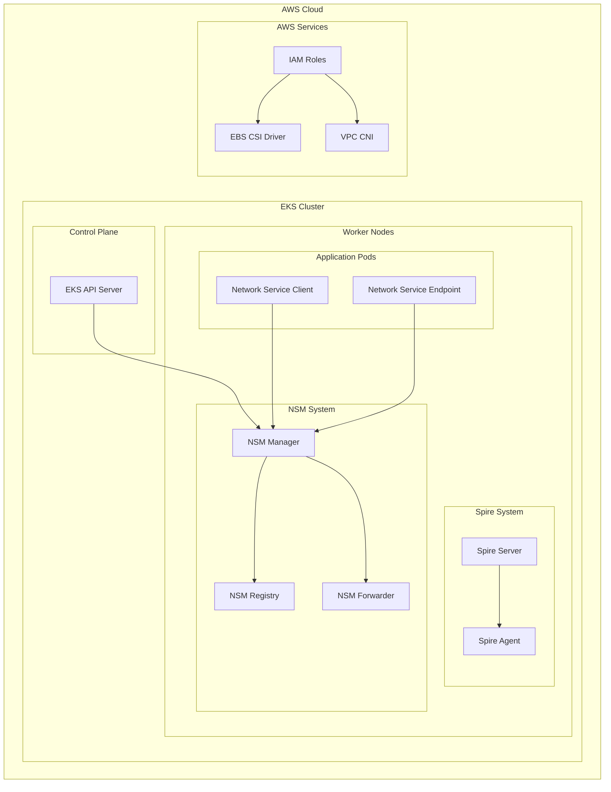

# Network Service Mesh on AWS EKS

This repository provides automated setup for Network Service Mesh (NSM) on Amazon EKS with complete infrastructure provisioning and NSM installation.

## Table of Contents

- [Overview](#overview)
- [Prerequisites](#prerequisites)
- [Quick Start](#quick-start)
- [Available Commands](#available-commands)
- [Installation Process](#installation-process)
- [Architecture](#architecture)
- [Verification](#verification)
- [Examples](#examples)
- [Troubleshooting](#troubleshooting)
- [Performance & Security](#performance--security)
- [Advanced Configuration](#advanced-configuration)
- [Cleanup](#cleanup)
- [FAQ](#faq)
- [Support](#support)

## Overview

Network Service Mesh (NSM) is a novel approach to solving complicated L2/L3 use cases in Kubernetes that are tricky to address with the existing Kubernetes Network Model. This setup includes:

- **AWS EKS Cluster** - Managed Kubernetes control plane
- **Spire** - SPIFFE identity framework for secure workload identity
- **Network Service Mesh** - Advanced networking capabilities for Kubernetes
- **EBS CSI Driver** - Persistent storage support
- **VPC CNI** - AWS native networking

## Repository Structure

```
nsm/
├── README.md                         # This documentation
├── LICENSE                           # Apache 2.0 license
├── doc/                              # Documentation
│   └── understanding-oidc-provider.md # OIDC provider deep dive
├── examples/                         # NSM examples and use cases
│   └── firewall-service/             # NSM firewall service example
└── eks-cluster/                      # EKS cluster setup automation
    ├── Makefile                      # Main automation script
    ├── eks-cluster-role-trust.yaml  # EKS cluster service role trust policy
    ├── eks-nodegroup-role-trust.yaml # EKS node group role trust policy
    └── eks-ebs-csi-role-trust.yaml  # EBS CSI driver role trust policy
```

## Prerequisites

### Required Tools
- **AWS CLI v2** - [Installation Guide](https://docs.aws.amazon.com/cli/latest/userguide/getting-started-install.html)
- **kubectl** - [Installation Guide](https://kubernetes.io/docs/tasks/tools/)
- **make** - Usually pre-installed on macOS/Linux
- **git** - For cloning the repository

### AWS Requirements
- **AWS Account** with appropriate permissions
- **AWS CLI configured** with credentials (`aws configure`)
- **IAM permissions** for EKS, IAM, EC2, and EBS management

### Verify Prerequisites
```bash
# Check AWS CLI and credentials
aws --version
aws sts get-caller-identity

# Check kubectl and make
kubectl version --client
make --version

# Or use the built-in validation
make validate
```

## Quick Start

### 1. Clone Repository
```bash
git clone https://github.com/daviderestivo/nsm.git
cd nsm/eks-cluster
```

### 2. Validate Prerequisites
```bash
# Check prerequisites and configuration
make validate
```

### 3. Preview Deployment
```bash
# See what will be created (dry-run)
make plan
```

### 4. Deploy Everything
```bash
# Create complete NSM-enabled EKS cluster
make all
```

**Default Configuration:**
- Cluster: `nsm-test` in `eu-central-2`
- Nodes: 4x t3.medium instances
- NSM Version: v1.14.0

**Custom Configuration:**
```bash
make all CLUSTER_NAME=my-cluster REGION=us-west-2 NODE_COUNT=6 INSTANCE_TYPE=t3.large
```

### 5. Check Status
```bash
# View cluster status and resources
make status
```

## Available Commands

### Getting Help
```bash
make help                    # Show all available targets and options
```

### Validation and Planning
```bash
make validate               # Check prerequisites and configuration
make plan                   # Preview what resources will be created
make status                 # Show current cluster status
```

### Deployment
```bash
make all                    # Complete setup (recommended)
make create-roles           # Create IAM roles only
make create-cluster         # Create EKS cluster only
make create-oidc-provider   # Create OIDC provider only
make create-nodegroup       # Create node group only
make install-addons         # Install AWS addons only
make install-nsm            # Install NSM components only
make setup-storage          # Configure storage only
```

### Cleanup
```bash
make clean-nsm              # Remove NSM components only
make clean                  # Delete everything (with confirmation)
```

### Configuration Options
```bash
CLUSTER_NAME=my-cluster     # Cluster name (default: nsm-test)
REGION=us-west-2           # AWS region (default: eu-central-2)
NODE_COUNT=6               # Number of nodes (default: 4)
INSTANCE_TYPE=t3.large     # Instance type (default: t3.medium)
NSM_VERSION=v1.15.0        # NSM version (default: v1.14.0)
```

## Installation Process

The `make all` command performs these steps:
1. **Validate prerequisites** - Check AWS CLI, kubectl, credentials, and region
2. **Create IAM roles** - EKS cluster, node group, and EBS CSI driver roles
3. **Create EKS cluster** - Kubernetes control plane (~10-15 minutes)
4. **Create OIDC provider** - For service account authentication (IRSA)
5. **Create node group** - Worker nodes with auto-scaling
6. **Install AWS addons** - VPC CNI and EBS CSI driver
7. **Install NSM** - Spire (SPIFFE) and Network Service Mesh components
8. **Configure storage** - Default storage class and kubeconfig

## Architecture

### NSM on EKS Components



**Key Components**:
- **NSM Manager**: Orchestrates network service connections
- **NSM Forwarder**: Handles data plane forwarding
- **NSM Registry**: Service discovery and endpoint registration
- **Spire Server/Agent**: SPIFFE identity management
- **Network Service Client (NSC)**: Consumes network services
- **Network Service Endpoint (NSE)**: Provides network services

## Verification

### Check Cluster
```bash
# Verify cluster status
kubectl get nodes
aws eks list-addons --cluster-name nsm-test --region eu-central-2
```

### Check NSM Components
```bash
# Spire components
kubectl get pods -n spire

# NSM system
kubectl get pods -n nsm-system

# Verify NSM readiness
kubectl wait -n nsm-system --for=condition=ready --timeout=3m pod -l app=admission-webhook-k8s
```

### Test Storage
```bash
kubectl get storageclass

# Test PVC creation
kubectl apply -f - <<EOF
apiVersion: v1
kind: PersistentVolumeClaim
metadata:
  name: test-pvc
spec:
  accessModes: [ReadWriteOnce]
  resources:
    requests:
      storage: 1Gi
EOF

kubectl get pvc test-pvc
kubectl delete pvc test-pvc
```

## Examples

Explore comprehensive NSM examples with detailed documentation:

| Example | Description | Use Case | Complexity |
|---------|-------------|----------|------------|
| [Basic](examples/basic/) | Kernel-to-kernel connectivity | NSM fundamentals | Beginner |
| [Virtual Wire](examples/vwire/) | L2 peer-to-peer communication | Legacy app support | Intermediate |
| [DNS Service](examples/dns/) | Secure DNS resolution | Service discovery | Intermediate |
| [Secure Tunnel](examples/secure-tunnel/) | Encrypted HTTP communication | Zero-trust networking | Advanced |
| [OPA Policy](examples/opa-policy/) | Role-based access control | API authorization | Advanced |

**Learning Path**:
1. Start with [Basic](examples/basic/) to understand NSM fundamentals
2. Try [Virtual Wire](examples/vwire/) for L2 networking concepts
3. Explore [DNS Service](examples/dns/) for service discovery patterns
4. Implement [Secure Tunnel](examples/secure-tunnel/) for application security
5. Master [OPA Policy](examples/opa-policy/) for advanced authorization

## Troubleshooting

**Common Issues**:

| Problem | Cause | Solution |
|---------|-------|----------|
| Cluster creation fails | IAM permissions or subnet issues | Check IAM roles and VPC configuration |
| NSM pods not starting | Resource constraints or image pull issues | Verify node resources and network connectivity |
| Examples not working | NSM system not ready | Wait for all NSM components to be ready |
| Storage issues | EBS CSI driver not configured | Verify EBS CSI driver installation |

**Cluster Creation Fails:**
```bash
# Check IAM roles and subnets
aws iam get-role --role-name EKS-Cluster-Role
aws ec2 describe-subnets --filters "Name=default-for-az,Values=true" --region eu-central-2
```

**NSM Installation Issues:**
```bash
# Check logs
kubectl logs -n spire -l app=spire-server
kubectl logs -n nsm-system -l app=admission-webhook-k8s

# Restart NSM
make clean-nsm
make install-nsm
```

**General Debugging:**
```bash
kubectl cluster-info
kubectl get events --sort-by=.metadata.creationTimestamp
kubectl describe nodes
```

## Advanced Configuration

## Cleanup

```bash
# Clean NSM only
make clean-nsm

# Clean everything (cluster, roles, NSM)
make clean
```

**Warning**: `make clean` permanently deletes all resources and data.

## Next Steps

- **Start with Examples**: Follow the [learning path](#examples) from basic to advanced
- **Production Setup**: Configure monitoring, logging, and GitOps workflows  
- **Security Hardening**: Implement private subnets and additional security controls
- **Custom Development**: Build your own Network Service Endpoints

## Advanced Configuration

<details>
<summary>Custom Configuration Options</summary>

**Environment Variables**:
```bash
# Cluster configuration
export CLUSTER_NAME=production-nsm
export REGION=us-west-2
export NODE_COUNT=8
export INSTANCE_TYPE=t3.xlarge

# NSM configuration
export NSM_VERSION=v1.15.0
export SPIRE_VERSION=1.8.0

# Deploy with custom settings
make all
```

**Private Subnet Deployment**:
```bash
# Use existing VPC with private subnets
export VPC_ID=vpc-12345678
export SUBNET_IDS=subnet-12345678,subnet-87654321
make create-cluster
```

**Production Hardening**:
```bash
# Enable additional security features
export ENABLE_IRSA=true
export ENABLE_ENCRYPTION=true
export ENABLE_LOGGING=true
make all
```
</details>

<details>
<summary>Monitoring & Observability</summary>

**NSM Metrics**:
```bash
# Enable Prometheus monitoring
kubectl apply -f https://raw.githubusercontent.com/networkservicemesh/deployments-k8s/main/examples/observability/jaeger.yaml

# Access NSM dashboard
kubectl port-forward -n nsm-system svc/jaeger 16686:16686
```

**Cluster Monitoring**:
```bash
# Check cluster health
kubectl get nodes -o wide
kubectl top nodes
kubectl top pods -A
```
</details>

## FAQ

<details>
<summary>What AWS permissions are required?</summary>

The deployment requires permissions for EKS, IAM, EC2, and EBS services. See the IAM policy examples in the `eks-cluster/` directory for specific permissions.
</details>

<details>
<summary>Can I use an existing EKS cluster?</summary>

Yes, you can install NSM on an existing cluster using `make install-nsm`. Ensure the cluster has the required addons (VPC CNI, EBS CSI driver).
</details>

<details>
<summary>How do I upgrade NSM to a newer version?</summary>

Update the `NSM_VERSION` variable and run `make clean-nsm && make install-nsm`. Always test upgrades in a non-production environment first.
</details>

<details>
<summary>What's the difference between NSM and service mesh solutions like Istio?</summary>

NSM operates at the network layer (L2/L3) providing secure connectivity, while service meshes like Istio focus on application layer (L7) features like traffic management and observability.
</details>

## Cleanup

## Support

- [Network Service Mesh Documentation](https://networkservicemesh.io/)
- [AWS EKS User Guide](https://docs.aws.amazon.com/eks/latest/userguide/)
- [Spire Documentation](https://spiffe.io/docs/latest/spire/)
- [GitHub Issues](https://github.com/daviderestivo/nsm/issues)

## Additional Readings

- [Understanding OIDC Provider](doc/understanding-oidc-provider.md) - Deep dive into OIDC providers and IRSA authentication

## License

This project is licensed under the Apache License 2.0 - see the [LICENSE](LICENSE) file for details.
