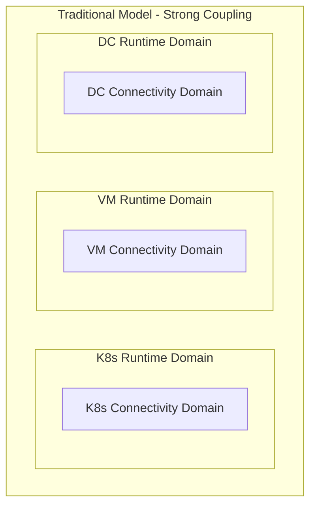

# Network Service Mesh Concepts

This document provides a comprehensive overview of Network Service Mesh (NSM) concepts, architecture, and components. For practical deployment instructions, see the [main README](../README.md).

## Table of Contents

- [The Problem NSM Solves](#the-problem-nsm-solves)
- [NSM Solution Overview](#nsm-solution-overview)
- [Core Architecture](#core-architecture)
- [Key Components](#key-components)
- [NSM in Kubernetes](#nsm-in-kubernetes)
- [Advanced Features](#advanced-features)
- [NSM vs Traditional Service Mesh](#nsm-vs-traditional-service-mesh)
- [Zero Trust and Security](#zero-trust-and-security)
- [Use Cases](#use-cases)
- [Acronyms](#acronyms)
- [Summary](#summary)

## The Problem NSM Solves

### Problem Statement

How do you enable workloads collaborating together to produce an application to communicate independent of where those workloads are running?

### Background

Traditionally, workloads have been constrained by their Runtime Domain (K8s, VM, or Data Center), with each domain providing exactly one Connectivity Domain. This creates strong coupling between where workloads run and how they communicate.



**Key Issues**:
- Connectivity domains are strongly coupled to runtime domains
- Workloads can only communicate within their runtime domain
- Multi-cloud and hybrid deployments face connectivity challenges
- No granular control over which workloads can communicate

**Example Scenario**: In a multi-cluster Kubernetes environment:


Requirements:
• Red Pods need to communicate across clusters
• Green Pods need isolated communication
• Some Pods need multi-network access
• Other Pods should have no cross-cluster access

## NSM Solution Overview

Network Service Mesh decouples connectivity from runtime domains, allowing individual workloads to connect securely to Network Services independent of where they run.


**Key Benefits**:
- **Runtime Independence**: Works across K8s, VMs, and physical servers
- **CNI Compatibility**: Does not replace existing CNI, works alongside it
- **Granular Control**: Per-workload network service connections
- **Secure by Default**: SPIFFE-based identity and encryption

## Core Architecture

### Key Concepts

#### Network Services
A Network Service is a collection of Connectivity, Security, and Observability features at L3 and above. Examples include:
- Distributed virtual L3 networks with optional DNS
- Traditional service meshes (Istio, Linkerd) over virtual networks
- Sophisticated security features (IPS, firewalls)

#### Clients (NSC - Network Service Client)
A Client is a workload that requests connection to a Network Service by name. Clients are:
- Independently authenticated via SPIFFE ID
- Must be authorized to connect to Network Services
- Can be Pods, VMs, or physical servers
- Can connect to multiple Network Services simultaneously

#### vWires (Virtual Wires)
vWires connect Clients to Endpoints with these guarantees:
- Packets ingressing at Client egress at Endpoint
- Packets ingressing at Endpoint egress at Client
- Only packets from the correct source reach the destination
- Each vWire carries traffic for exactly one Network Service


Properties:
• Bidirectional communication
• Encrypted in transit (SPIFFE/TLS)
• One vWire per Network Service
• Multiple vWires per Client possible

#### Endpoints (NSE - Network Service Endpoint)
Endpoints provide Network Services to Clients. They can be:
- Pods in the same or different K8s clusters
- VMs or physical network components
- Any entity that can process packets

### Network Service API

The NSM API consists of three main operations:

```mermaid
sequenceDiagram
    participant Client
    participant NSM as NSM Manager
    participant Endpoint
    
    Client->>NSM: 1. Request(NetworkService)
    NSM->>Endpoint: 2. Find Endpoint
    Endpoint->>NSM: 3. Establish Connection
    NSM->>Client: 4. Connection Response
    
    Note over Client,Endpoint: Data Flow
    Client<-->Endpoint: Secure Communication
    
    Client->>NSM: 5. Monitor(Connection)
    NSM->>Client: 6. Status Updates
    
    Client->>NSM: 7. Close(Connection)
    NSM->>Endpoint: 8. Cleanup
```

1. **Request**: Creates a vWire between Client and Network Service
2. **Close**: Formally closes a vWire connection
3. **Monitor**: Provides connection status updates and handles expiration

### Registries

NSM uses Network Service Registries (NSR) for service discovery:

#### Network Service Registration
```yaml
apiVersion: networkservicemesh.io/v1
kind: NetworkService
metadata:
  name: my-service
spec:
  payload: IP  # or ETHERNET
```

#### Registry Domains
Network Services can be scoped to domains using `@domain` syntax:
- `service-mesh@finance.example.com`
- Enables internet-scale service discovery
- Supports floating domains not tied to specific runtime domains

## Key Components

### Control Plane Components

#### Network Service Manager (NSMgr)
- **Purpose**: Core orchestration component
- **Responsibilities**:
  - Network Service and Endpoint discovery
  - Client request processing
  - Connection state management
  - Registry functionality (optional)

#### Registry
- **Purpose**: Storage for Network Services and Endpoints
- **Responsibilities**:
  - Service and endpoint registration
  - Expiration management
  - Inter-domain query proxying

#### Registry Proxy DNS
- **Purpose**: Inter-domain service discovery
- **Responsibilities**:
  - Remote registry IP resolution
  - Cross-domain request proxying
  - URL translation for external access

#### NSMgr Proxy
- **Purpose**: Inter-domain connection establishment
- **Responsibilities**:
  - Cross-domain connection proxying
  - IP address translation
  - Service name translation

### Data Plane Components

#### Forwarder
- **Purpose**: Network interface management
- **Responsibilities**:
  - Client and endpoint interface creation
  - Mechanism selection for connections
  - Statistics collection
  - Load balancing
  - Connection context management

**Available Implementations**:
- **Forwarder VPP**: Uses Vector Packet Processing for high performance
- **Forwarder OVS**: Uses Open vSwitch for flexibility

### Kubernetes Integration Components

#### Admission Webhook K8s
- **Purpose**: Automatic NSM client injection
- **Responsibilities**:
  - Inject NSM clients into annotated Pods
  - Namespace-level injection support

#### Exclude Prefixes K8s
- **Purpose**: IP address management
- **Responsibilities**:
  - Collect Kubernetes network prefixes
  - Prevent NSM/K8s IP conflicts

#### Map IP K8s
- **Purpose**: Inter-domain IP mapping
- **Responsibilities**:
  - Map internal Pod IPs to external node IPs
  - Support cross-cluster connectivity

## NSM in Kubernetes

### Adding Network Services to Pods

Pods request Network Services using annotations:

```yaml
apiVersion: v1
kind: Pod
metadata:
  name: my-app
  annotations:
    networkservicemesh.io: "kernel://my-networkservice-1"
spec:
  # ... pod specification
```

**Annotation Options**:
- **Basic**: `kernel://my-networkservice-1`
- **Named Interface**: `kernel://my-networkservice-1/nsm-1`
- **With Labels**: `kernel://my-networkservice-1/nsm-1?app=foo&version=v1.1`
- **Multiple Services**: `kernel://service-1, kernel://service-2`

### IPAM and Routing

For each Network Service connection:
- New kernel interface injected into Pod
- IP address assigned by the Endpoint
- Routes configured for Network Service traffic
- IP collision prevention with cluster networks

### DNS Integration

Network Services can provide DNS service:
- Scoped to specific domains/subdomains
- Parallel queries to cluster DNS and Network Service DNS
- First positive response returned to Pod

## Advanced Features

### Composition
Network Services can be composed of multiple Endpoints working together:
- Example: Envoy Proxy + vL3 network for service mesh
- Flexible service chaining
- Policy-driven composition


Flow:
1. Client requests service-mesh network service
2. NSM routes to Envoy Proxy endpoint first
3. Envoy Proxy connects to vL3 endpoint
4. Traffic: Client → Envoy → vL3 → Destination

### Selective Composition
Different clients can receive different service compositions:
- Example: IPS insertion for vulnerable application versions
- Label-based service selection
- Granular security controls


Policy Logic:
• v1.1 apps → IPS → vL3 (security filtering)
• v1.2 apps → vL3 (direct access)

### Topologically Aware Features

#### Endpoint Selection
Select Endpoints based on topology:
```yaml
destination_selector:
  nodeName: "{{ .nodeName }}"  # Same node preference
```

#### Scale from Zero
Automatically create Endpoints when needed:
- First match: existing Endpoint on same node
- Second match: supplier creates new Endpoint
- Reselection connects to newly created Endpoint

## NSM vs Traditional Service Mesh

### Complementary Technologies


**Traditional Service Mesh** (Istio, Linkerd, Consul):
- Focus on L7 payloads (HTTPS)
- Application-level features
- Traffic management and observability

**Network Service Mesh**:
- Focus on L3/L2 payloads (IP packets)
- Network-level connectivity
- Secure tunneling and isolation

### Better Together
- Traditional service meshes can be Network Services
- Workloads can connect to multiple service meshes
- Cross-company collaboration through shared NSM

## Zero Trust and Security

NSM implements Zero Trust principles:


**Core Security Features**:
- **SPIFFE Identity**: Cryptographic workload identity
- **Mutual TLS**: All connections authenticated
- **Minimal Access**: Granular Network Service connections
- **Audit Trail**: Cryptographic identity from L3-L7
- **Certificate Management**: Automatic rotation and renewal

**Zero Trust Benefits**:
- Users get minimum required access
- Compromised devices have contained damage
- Cryptographic auditability across network layers
- Policy-driven access control

## Use Cases

### Enterprise Scenarios
- **Multi-cloud Connectivity**: Secure workload communication across clouds
- **Legacy Application Support**: L2/L3 connectivity for existing applications
- **Compliance Requirements**: Encrypted, auditable communications
- **Partner Collaboration**: Selective cross-company workload access

### Technical Applications
- **Database Replication**: Secure DB-to-DB communication
- **Network Function Virtualization**: Chained network services
- **Development/Testing**: Isolated network environments
- **Microservice Security**: Per-service network policies

## Acronyms

| Acronym | Full Form | Description |
|---------|-----------|-------------|
| **NSM** | Network Service Mesh | Cloud-native networking solution for secure workload connectivity |
| **NSC** | Network Service Client | Workload that consumes network services |
| **NSE** | Network Service Endpoint | Component that provides network services |
| **NSR** | Network Service Registries | Storage and discovery system for network services and endpoints |
| **NSMgr** | Network Service Manager | Core orchestration component that manages connections |
| **SPIFFE** | Secure Production Identity Framework for Everyone | Identity framework for workload authentication |
| **vWire** | Virtual Wire | Secure connection between client and endpoint |
| **vL3** | Virtual Layer 3 | Virtual L3 network service providing IP connectivity |

## Summary

Network Service Mesh provides a novel approach to cloud-native networking by:

1. **Decoupling** connectivity from runtime domains
2. **Enabling** secure, granular workload communication
3. **Supporting** multi-cloud and hybrid environments
4. **Implementing** Zero Trust networking principles
5. **Complementing** existing service mesh technologies

This architecture enables organizations to build secure, scalable, and flexible network infrastructures that adapt to modern distributed application requirements.
