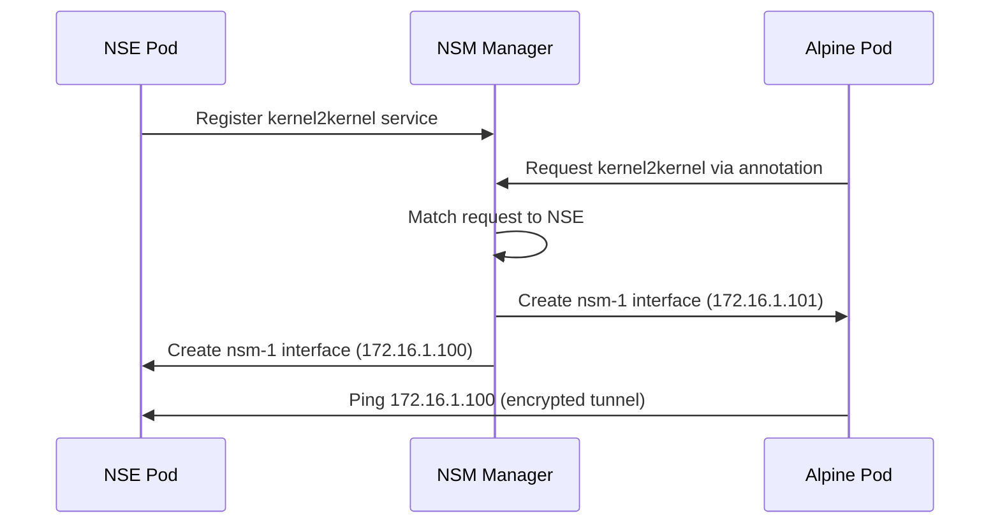

# Basic NSM Example: Kernel-to-Kernel Connectivity

Your first NSM connection demonstrating secure pod-to-pod communication.

## Table of Contents

- [Prerequisites](#prerequisites)
- [Quick Start](#quick-start)
- [Architecture Overview](#architecture-overview)
- [How It Works](#how-it-works)
- [YAML Files Deep Dive](#yaml-files-deep-dive)
- [Verification](#verification-commands)
- [Troubleshooting](#troubleshooting)
- [Advanced Usage](#advanced-usage)
- [Cleanup](#cleanup)

## Prerequisites

- NSM-enabled EKS cluster (see [main README](../../README.md))
- kubectl configured for your cluster
- Basic understanding of Kubernetes pods and networking

## Quick Start

```bash
# Deploy and test
./deploy.sh

# Manual verification
kubectl exec alpine -n ns-kernel2kernel -- ping -c 4 172.16.1.100
kubectl exec alpine -n ns-kernel2kernel -- ip addr show nsm-1
```

## What You'll Learn

- NSM secure pod-to-pod connectivity
- Network service registration and discovery  
- Kernel networking mechanism (highest performance)
- SPIFFE identity-based security model

## Architecture Overview

```
┌─────────────────┐    NSM Network    ┌─────────────────┐
│     Client      │◄─────────────────►│     Server      │
│  Alpine Pod     │   172.16.1.100/31 │   NSE (ICMP)    │
│ 172.16.1.101    │                   │ 172.16.1.100    │
└─────────────────┘                   └─────────────────┘
```

**Components**:
- **Client**: Alpine pod requesting network service
- **Server**: NSE providing ICMP response service  
- **Connection**: Encrypted kernel-to-kernel tunnel
- **Network**: Private /31 subnet (172.16.1.100/31)

## How It Works



**Flow Summary**:
1. **Server registers**: NSE advertises `kernel2kernel` service capability
2. **Client requests**: Pod annotation triggers service request
3. **NSM orchestrates**: Creates secure tunnel with dedicated interfaces
4. **Traffic flows**: Direct encrypted communication bypassing CNI

This is the foundation - all other examples build on this pattern.

## YAML Files Deep Dive

### namespace.yaml
```yaml
apiVersion: v1
kind: Namespace
metadata:
  name: ns-kernel2kernel
```
**Purpose**: Creates isolated Kubernetes namespace for this NSM example.
- **Isolation**: Separates resources from other examples and system components
- **Naming**: `ns-kernel2kernel` indicates this is NSM kernel-to-kernel connectivity
- **Best Practice**: Each NSM example uses dedicated namespace for clean separation

### netsvc.yaml
```yaml
apiVersion: networkservicemesh.io/v1
kind: NetworkService
metadata:
  name: kernel2kernel
spec:
  payload: ETHERNET
```
**Purpose**: Defines the network service contract that NSEs provide and NSCs consume.

**Key Fields**:
| Field | Value | Purpose |
|-------|-------|---------|
| `apiVersion` | `networkservicemesh.io/v1` | NSM CRD API version |
| `name` | `kernel2kernel` | Service identifier for client requests |
| `payload` | `ETHERNET` | Layer 2 connectivity type |

**Available Payload Types**:
| Type | Layer | Use Case |
|------|-------|----------|
| `ETHERNET` | L2 | MAC addresses, VLANs, bridging |
| `IP` | L3 | IP routing, subnets |
| `MPLS` | L2.5 | Label switching, traffic engineering |

**Service Discovery**: NSM uses this resource to match client requests with available endpoints.

### client.yaml
```yaml
apiVersion: v1
kind: Pod
metadata:
  name: alpine
  labels:
    app: alpine
  annotations:
    networkservicemesh.io: kernel://kernel2kernel/nsm-1
spec:
  containers:
  - name: alpine
    image: alpine:3.15.0
    imagePullPolicy: IfNotPresent
    command: ["/bin/sh", "-c", "trap : TERM INT; sleep infinity & wait"]
  affinity:
    podAffinity:
      requiredDuringSchedulingIgnoredDuringExecution:
        - topologyKey: kubernetes.io/hostname
          labelSelector:
            matchExpressions:
              - key: app
                operator: In
                values:
                  - nse-kernel
```

**Purpose**: Network Service Client (NSC) that consumes the kernel2kernel service.

**Critical Annotation**:
```
networkservicemesh.io: kernel://kernel2kernel/nsm-1
```
- **Protocol**: `kernel://` - Use kernel networking mechanism (highest performance)
- **Service**: `kernel2kernel` - Request this specific NetworkService
- **Interface**: `nsm-1` - Name of interface created inside pod
- **Alternative Protocols**: `memif://`, `vfio://`, `wireguard://`

**Container Configuration**:
- **Image**: `alpine:3.15.0` - Lightweight Linux for testing
- **Command**: Uses `trap` for graceful shutdown handling
- **Purpose**: Simple client to test connectivity

**Pod Affinity**:
- **requiredDuringSchedulingIgnoredDuringExecution**: Hard requirement
- **topologyKey**: `kubernetes.io/hostname` - same node placement
- **labelSelector**: Targets pods with `app: nse-kernel`
- **Reason**: Ensures client and server on same node for this basic example

### nse-base.yaml
```yaml
apiVersion: apps/v1
kind: Deployment
metadata:
  name: nse-kernel
  labels:
    app: nse-kernel
spec:
  selector:
    matchLabels:
      app: nse-kernel
  template:
    metadata:
      labels:
        app: nse-kernel
        "spiffe.io/spiffe-id": "true"
    spec:
      containers:
        - name: nse
          image: ghcr.io/networkservicemesh/ci/cmd-nse-icmp-responder:a00fa0f
          imagePullPolicy: IfNotPresent
          env:
            - name: SPIFFE_ENDPOINT_SOCKET
              value: unix:///run/spire/sockets/agent.sock
            - name: POD_NAME
              valueFrom:
                fieldRef:
                  fieldPath: metadata.name
            - name: NSM_NAME
              value: "$(POD_NAME)"
            - name: NSM_LOG_LEVEL
              value: TRACE
            - name: NSM_CONNECT_TO
              value: unix:///var/lib/networkservicemesh/nsm.io.sock
            - name: NSM_CIDR_PREFIX
              value: 172.16.1.100/31
            - name: NSM_SERVICE_NAMES
              value: "kernel2kernel"
            - name: NSM_REGISTER_SERVICE
              value: "false"
          volumeMounts:
            - name: spire-agent-socket
              mountPath: /run/spire/sockets
              readOnly: true
            - name: nsm-socket
              mountPath: /var/lib/networkservicemesh
              readOnly: true
          resources:
            requests:
              cpu: 100m
              memory: 40Mi
            limits:
              memory: 80Mi
              cpu: 200m
      volumes:
        - name: spire-agent-socket
          hostPath:
            path: /run/spire/sockets
            type: Directory
        - name: nsm-socket
          hostPath:
            path: /var/lib/networkservicemesh
            type: DirectoryOrCreate
```

**Purpose**: Network Service Endpoint (NSE) that provides the kernel2kernel service.

**Container Image**:
- **cmd-nse-icmp-responder**: NSM component that responds to ICMP ping requests
- **Function**: Creates network interface and responds to ping traffic
- **Registry**: GitHub Container Registry (ghcr.io)

**Critical Environment Variables**:

| Category | Variable | Value | Purpose |
|----------|----------|-------|---------|
| **Identity** | `SPIFFE_ENDPOINT_SOCKET` | `unix:///run/spire/sockets/agent.sock` | SPIFFE identity verification |
| | `POD_NAME` | `$(metadata.name)` | Unique NSE identification |
| **NSM Config** | `NSM_CONNECT_TO` | `unix:///var/lib/networkservicemesh/nsm.io.sock` | NSM manager communication |
| | `NSM_LOG_LEVEL` | `TRACE` | Detailed debugging logs |
| **Network** | `NSM_CIDR_PREFIX` | `172.16.1.100/31` | IP subnet (2 IPs: .100/.101) |
| | `NSM_SERVICE_NAMES` | `kernel2kernel` | Service this NSE provides |

**Volume Mounts**:
- **spire-agent-socket**: 
  - **Path**: `/run/spire/sockets`
  - **Purpose**: SPIFFE identity verification
  - **Security**: Enables mutual TLS authentication
- **nsm-socket**:
  - **Path**: `/var/lib/networkservicemesh`
  - **Purpose**: Communication with NSM manager
  - **Function**: Service registration and connection management

**Resource Limits**:
- **Requests**: 100m CPU, 40Mi memory (guaranteed resources)
- **Limits**: 200m CPU, 80Mi memory (maximum allowed)
- **Purpose**: Prevent resource starvation in cluster

**Labels**:
- `spiffe.io/spiffe-id: "true"`: Enables SPIFFE identity injection
- `app: nse-kernel`: Used by client affinity rules

## NSM Connection Flow Detailed

### Phase 1: Service Registration
1. **NSE Startup**: `nse-kernel` deployment starts
2. **Spire Identity**: NSE obtains SPIFFE identity from Spire agent
3. **NSM Registration**: NSE registers with NSM manager via Unix socket
4. **Service Advertisement**: NSE advertises `kernel2kernel` service capability

### Phase 2: Client Request
1. **Pod Creation**: Alpine pod starts with NSM annotation
2. **NSM Detection**: NSM init container detects annotation
3. **Service Request**: NSM client requests `kernel2kernel` service
4. **Endpoint Discovery**: NSM manager finds matching NSE

### Phase 3: Connection Establishment
1. **Path Computation**: NSM calculates optimal connection path
2. **Interface Creation**: Kernel interface `nsm-1` created in client pod
3. **IP Assignment**: 
   - Client: 172.16.1.101/31
   - Server: 172.16.1.100/31
4. **Route Installation**: Routes installed for direct communication

### Phase 4: Secure Tunnel
1. **Identity Verification**: Mutual SPIFFE identity verification
2. **Encryption**: TLS tunnel established using Spire-issued certificates
3. **Traffic Flow**: ICMP/IP traffic flows through secure kernel interface

## Network Interface Details

**Client Side (Alpine Pod)**:
```bash
# Interface created by NSM
nsm-1: 172.16.1.101/31
# Route to server
172.16.1.100/32 dev nsm-1
```

**Server Side (NSE Pod)**:
```bash
# Interface created by NSM
nsm-1: 172.16.1.100/31
# Route to client
172.16.1.101/32 dev nsm-1
```

## Security Model

**SPIFFE/Spire Integration**:
- **Identity**: Each workload gets cryptographic identity
- **Certificates**: Short-lived X.509 certificates (default 1 hour)
- **Rotation**: Automatic certificate rotation
- **Verification**: Mutual TLS authentication for all NSM connections

**Network Isolation**:
- **Dedicated Interfaces**: NSM creates isolated network interfaces
- **No CNI Overlap**: NSM traffic bypasses Kubernetes CNI
- **Encrypted Transit**: All traffic encrypted in transit

**Expected Results**:
```bash
# Successful ping output
PING 172.16.1.100 (172.16.1.100): 56 data bytes
64 bytes from 172.16.1.100: seq=0 ttl=64 time=0.123 ms
64 bytes from 172.16.1.100: seq=1 ttl=64 time=0.089 ms
64 bytes from 172.16.1.100: seq=2 ttl=64 time=0.095 ms
64 bytes from 172.16.1.100: seq=3 ttl=64 time=0.091 ms

# NSM interface details
nsm-1: <POINTOPOINT,MULTICAST,NOARP,UP,LOWER_UP> mtu 1500 qdisc noqueue state UNKNOWN
    inet 172.16.1.101/31 scope global nsm-1
```

## Verification Commands

```bash
# Check pod status
kubectl get pods -n ns-kernel2kernel

# Test connectivity
kubectl exec alpine -n ns-kernel2kernel -- ping -c 4 172.16.1.100

# Inspect NSM interface
kubectl exec alpine -n ns-kernel2kernel -- ip addr show nsm-1
kubectl exec alpine -n ns-kernel2kernel -- ip route | grep nsm-1

# Check NSE logs
kubectl logs -n ns-kernel2kernel -l app=nse-kernel
```

## Troubleshooting

**Connection Issues**:
```bash
# Check NSM system health
kubectl get pods -n nsm-system
kubectl logs -n nsm-system -l app=nsmgr

# Verify NSE registration  
kubectl logs -n ns-kernel2kernel -l app=nse-kernel

# Debug client connection
kubectl exec alpine -n ns-kernel2kernel -- ip addr show nsm-1
kubectl describe pod alpine -n ns-kernel2kernel
```

**Common Issues**:
| Problem | Cause | Solution |
|---------|-------|----------|
| No `nsm-1` interface | NSM client connection failed | Check NSM system pods, verify annotation |
| Ping timeout | NSE not responding | Check NSE logs, verify service registration |
| Pod pending | Node affinity constraint | Check node labels, relax affinity if needed |
| Connection refused | Network policy blocking | Verify NSM system has required permissions |

## Advanced Usage

<details>
<summary>Customization Options</summary>

**Custom IP Range**:
```bash
# Edit nse-base.yaml
env:
  - name: NSM_CIDR_PREFIX
    value: "10.0.0.100/31"  # Custom subnet
```

**Cross-Node Deployment**:
```bash
# Remove affinity from client.yaml
# spec:
#   affinity: {}  # Comment out or remove
```

**Multiple Clients**:
```bash
# Scale client deployment
kubectl scale deployment alpine --replicas=3 -n ns-kernel2kernel
```
</details>

<details>
<summary>Monitoring & Observability</summary>

**NSM Metrics**:
```bash
# Check NSM manager metrics
kubectl port-forward -n nsm-system svc/nsmgr 9090:9090
curl localhost:9090/metrics | grep nsm
```

**Connection Status**:
```bash
# List active connections
kubectl get networkserviceendpoints -A
kubectl get networkservices -A
```
</details>

## Next Steps

- **Explore Advanced Examples**: Try [vwire](../vwire/), [dns](../dns/), or [secure-tunnel](../secure-tunnel/)
- **Multi-Node Setup**: Remove pod affinity to test cross-node connectivity
- **Custom NSE**: Build your own Network Service Endpoint
- **Monitoring**: Add observability with NSM metrics and tracing

## Cleanup

```bash
# Remove all resources
./cleanup.sh

# Verify cleanup
kubectl get pods -n ns-kernel2kernel
```

## FAQ

<details>
<summary>Why use /31 subnet instead of /30?</summary>

A /31 subnet is optimal for point-to-point links as defined in RFC 3021. It provides exactly 2 usable IP addresses without network/broadcast addresses, making it perfect for NSM connections.
</details>

<details>
<summary>Can I use this across different nodes?</summary>

Yes, remove the pod affinity constraint in client.yaml. NSM will automatically handle cross-node connectivity using the underlying network infrastructure.
</details>

<details>
<summary>What happens if the NSE pod restarts?</summary>

NSM automatically detects the restart and re-establishes the connection. The client will experience brief connectivity loss during the transition.
</details>

## Additional Resources

- [NSM Documentation](https://networkservicemesh.io/)
- [SPIFFE/Spire Guide](https://spiffe.io/docs/latest/spire/)
- [Kubernetes Networking Concepts](https://kubernetes.io/docs/concepts/services-networking/)

## Issues?

**No ping response:**
```bash
kubectl get pods -n ns-kernel2kernel
kubectl logs -n nsm-system -l app=nsmgr
```
