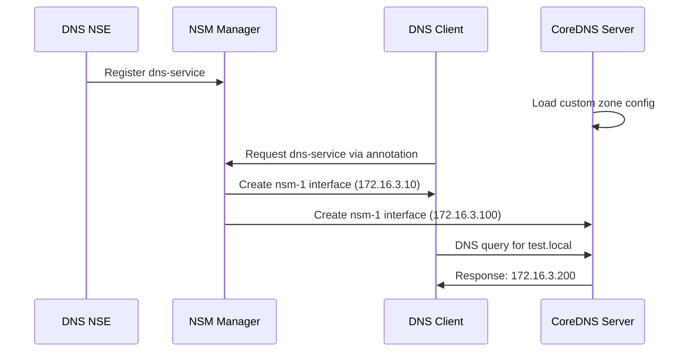

# DNS Service NSM Example: Secure DNS Resolution

Demonstrates isolated DNS service accessible only through NSM with custom domain resolution.

## Table of Contents

- [Prerequisites](#prerequisites)
- [Quick Start](#quick-start)
- [Architecture Overview](#architecture-overview)
- [How It Works](#how-it-works)
- [YAML Files Deep Dive](#yaml-files-deep-dive)
- [DNS Configuration](#dns-configuration)
- [Expected Results](#expected-results)
- [Verification](#verification-commands)
- [Troubleshooting](#troubleshooting)
- [Advanced Usage](#advanced-usage)
- [FAQ](#faq)
- [Cleanup](#cleanup)

## Prerequisites

- NSM-enabled EKS cluster (see [main README](../../README.md))
- kubectl configured for your cluster
- Completed [basic example](../basic/) for NSM fundamentals
- Understanding of DNS concepts and CoreDNS

## Quick Start

```bash
# Deploy and test
./deploy.sh

# Test custom DNS resolution
kubectl exec dns-client -n ns-dns -- nslookup test.local 172.16.3.100
kubectl exec dns-client -n ns-dns -- dig @172.16.3.100 server.local
```

## What You'll Learn

- Service-specific networking with NSM isolation
- Secure DNS service deployment and configuration
- Custom DNS zone management with CoreDNS
- DNS-based service discovery patterns

## Architecture Overview

```
┌─────────────────┐    NSM Network    ┌─────────────────┐
│   DNS Client    │◄─────────────────►│   DNS Server    │
│  Alpine + dig   │   172.16.3.0/24   │   CoreDNS       │
│ 172.16.3.10     │                   │ 172.16.3.100    │
└─────────────────┘                   └─────────────────┘
                                              │
                                              ▼
                                      ┌───────────────┐
                                      │ Custom Zones  │
                                      │ test.local    │
                                      │ server.local  │
                                      └───────────────┘
```

**Components**:
- **DNS Client**: Alpine pod with DNS tools (172.16.3.10)
- **DNS Server**: CoreDNS with custom zone configuration (172.16.3.100)
- **NSM Network**: Isolated /24 subnet for secure DNS communication
- **Custom Zones**: Local domain entries for service discovery

## How It Works



**Flow Summary**:
1. **DNS server initialization**: CoreDNS loads custom zone configuration
2. **NSM network setup**: Client and server connect via secure tunnel
3. **DNS resolution**: Queries flow through NSM-isolated network
4. **Service discovery**: Custom domains resolve to internal addresses

## YAML Files Deep Dive

### namespace.yaml
```yaml
apiVersion: v1
kind: Namespace
metadata:
  name: ns-dns
```
**Purpose**: Creates isolated namespace for DNS service example.

### netsvc.yaml
```yaml
apiVersion: networkservicemesh.io/v1
kind: NetworkService
metadata:
  name: dns-service
spec:
  payload: IP
```
**Purpose**: Defines DNS network service for IP-based communication.

**Key Configuration**:
| Field | Value | Purpose |
|-------|-------|---------|
| `name` | `dns-service` | Service identifier for DNS |
| `payload` | `IP` | Layer 3 IP connectivity |

### dns-client.yaml
```yaml
apiVersion: v1
kind: Pod
metadata:
  name: dns-client
  annotations:
    networkservicemesh.io: kernel://dns-service/nsm-1?ip=172.16.3.10/24
spec:
  containers:
  - name: alpine
    image: alpine:3.15.0
    command: ["/bin/sh", "-c", "apk add --no-cache bind-tools && trap : TERM INT; sleep infinity & wait"]
```

**Purpose**: DNS client with tools for testing DNS resolution.

**Key Features**:
- **DNS Tools**: Installs `bind-tools` package (nslookup, dig)
- **Static IP**: Fixed IP address for predictable testing
- **NSM Connection**: Connects to dns-service via kernel interface

### dns-server.yaml
```yaml
apiVersion: v1
kind: Pod
metadata:
  name: dns-server
  annotations:
    networkservicemesh.io: kernel://dns-service/nsm-1?ip=172.16.3.100/24
spec:
  containers:
  - name: coredns
    image: coredns/coredns:1.8.6
    args: ["-conf", "/etc/coredns/Corefile"]
    ports:
    - containerPort: 53
      protocol: UDP
    - containerPort: 53
      protocol: TCP
    volumeMounts:
    - name: config
      mountPath: /etc/coredns
  volumes:
  - name: config
    configMap:
      name: coredns-config
```

**Purpose**: CoreDNS server providing custom DNS resolution.

**Key Configuration**:
- **CoreDNS Image**: Official CoreDNS container
- **Custom Config**: Mounts ConfigMap with zone definitions
- **Dual Protocol**: Supports both UDP and TCP DNS queries
- **Static IP**: Fixed address for client configuration

### coredns-config.yaml
```yaml
apiVersion: v1
kind: ConfigMap
metadata:
  name: coredns-config
data:
  Corefile: |
    .:53 {
        file /etc/coredns/db.local local
        log
        errors
    }
  db.local: |
    $ORIGIN local.
    @   3600 IN SOA sns.dns.icann.org. noc.dns.icann.org. (
                2017042745 ; serial
                7200       ; refresh (2 hours)
                3600       ; retry (1 hour)
                1209600    ; expire (2 weeks)
                3600       ; minimum (1 hour)
                )
    
    test    IN A 172.16.3.200
    server  IN A 172.16.3.100
```

**Purpose**: CoreDNS configuration with custom local zone.

## DNS Configuration

**Custom Zone Entries**:
| Domain | Type | Value | Purpose |
|--------|------|-------|---------|
| `test.local` | A | 172.16.3.200 | Test service endpoint |
| `server.local` | A | 172.16.3.100 | DNS server self-reference |

**CoreDNS Features**:
- **File Plugin**: Serves zone from static file
- **Logging**: Detailed query logging for debugging
- **Error Handling**: Proper error responses for invalid queries

### nse.yaml
```yaml
apiVersion: apps/v1
kind: Deployment
metadata:
  name: dns-nse
spec:
  template:
    spec:
      containers:
      - name: nse
        image: ghcr.io/networkservicemesh/ci/cmd-nse-icmp-responder:a00fa0f
        env:
        - name: NSM_CIDR_PREFIX
          value: 172.16.3.0/24
        - name: NSM_SERVICE_NAMES
          value: "dns-service"
```

**Purpose**: Network Service Endpoint enabling DNS service connectivity.

## Expected Results

**Successful Deployment**:
```bash
# Pod status
NAME         READY   STATUS    RESTARTS   AGE
dns-client   1/1     Running   0          45s
dns-server   1/1     Running   0          50s
dns-nse      1/1     Running   0          55s

# DNS resolution test
Server:    172.16.3.100
Address:   172.16.3.100#53

Name:      test.local
Address:   172.16.3.200

# Connectivity test
PING 172.16.3.100 (172.16.3.100): 56 data bytes
64 bytes from 172.16.3.100: seq=0 ttl=64 time=0.156 ms
```

## Verification Commands

```bash
# Check all pods
kubectl get pods -n ns-dns

# Test custom DNS resolution
kubectl exec dns-client -n ns-dns -- nslookup test.local 172.16.3.100
kubectl exec dns-client -n ns-dns -- nslookup server.local 172.16.3.100

# Advanced DNS queries
kubectl exec dns-client -n ns-dns -- dig @172.16.3.100 test.local
kubectl exec dns-client -n ns-dns -- dig @172.16.3.100 server.local ANY

# Test connectivity
kubectl exec dns-client -n ns-dns -- ping -c 4 172.16.3.100

# Check DNS server logs
kubectl logs dns-server -n ns-dns

# Verify NSM interfaces
kubectl exec dns-client -n ns-dns -- ip addr show nsm-1
kubectl exec dns-server -n ns-dns -- ip addr show nsm-1
```

## Troubleshooting

**DNS Resolution Issues**:
```bash
# Check CoreDNS status
kubectl logs dns-server -n ns-dns
kubectl exec dns-server -n ns-dns -- ps aux | grep coredns

# Verify configuration
kubectl get configmap coredns-config -n ns-dns -o yaml

# Test basic connectivity
kubectl exec dns-client -n ns-dns -- ping -c 2 172.16.3.100

# Check NSM connection
kubectl exec dns-client -n ns-dns -- ip route | grep nsm-1
```

**Common Issues**:
| Problem | Cause | Solution |
|---------|-------|----------|
| DNS timeout | CoreDNS not running | Check DNS server pod logs |
| NXDOMAIN response | Zone file error | Verify ConfigMap configuration |
| Connection refused | Wrong IP/port | Check server IP and port 53 |
| No nsm-1 interface | NSM connection failed | Verify NSM annotation syntax |

## Advanced Usage

<details>
<summary>Customization Options</summary>

**Custom DNS Zones**:
```yaml
# Add more zones to ConfigMap
data:
  db.example: |
    $ORIGIN example.
    api    IN A 172.16.3.201
    web    IN A 172.16.3.202
    db     IN A 172.16.3.203
```

**DNS Forwarding**:
```yaml
# Forward external queries
Corefile: |
  .:53 {
      file /etc/coredns/db.local local
      forward . 8.8.8.8 9.9.9.9
      log
      errors
  }
```

**Multiple DNS Clients**:
```bash
# Create additional clients
kubectl apply -f - <<EOF
apiVersion: v1
kind: Pod
metadata:
  name: dns-client-2
  namespace: ns-dns
  annotations:
    networkservicemesh.io: kernel://dns-service/nsm-1?ip=172.16.3.11/24
spec:
  containers:
  - name: alpine
    image: alpine:3.15.0
    command: ["/bin/sh", "-c", "apk add --no-cache bind-tools && sleep infinity"]
EOF
```
</details>

<details>
<summary>Monitoring & Observability</summary>

**DNS Metrics**:
```bash
# Enable CoreDNS metrics
Corefile: |
  .:53 {
      file /etc/coredns/db.local local
      prometheus :9153
      log
      errors
  }

# Query metrics
kubectl port-forward dns-server 9153:9153 -n ns-dns
curl localhost:9153/metrics | grep coredns
```

**Query Analysis**:
```bash
# Monitor DNS queries in real-time
kubectl logs -f dns-server -n ns-dns
```
</details>

## Use Cases

**When to Use DNS Service**:
- **Service Discovery**: Internal DNS for microservice communication
- **Security Compliance**: Isolated DNS resolution requirements
- **Custom Domains**: Application-specific domain names
- **Development/Testing**: Controlled DNS environment

**Real-World Scenarios**:
- Microservice service discovery
- Development environment with mock services
- Compliance requirements for DNS isolation
- Custom internal domain resolution

## FAQ

<details>
<summary>Can I use this for external DNS resolution?</summary>

Yes, configure CoreDNS with forwarding to external DNS servers (8.8.8.8, 1.1.1.1) for queries not in local zones.
</details>

<details>
<summary>How do I add more DNS records?</summary>

Edit the ConfigMap `coredns-config` and restart the DNS server pod to reload the configuration.
</details>

<details>
<summary>Can multiple clients share the same DNS service?</summary>

Yes, create additional client pods with unique IP addresses in the same subnet. All will access the same DNS server.
</details>

## Next Steps

- **Explore Advanced Examples**: Try [secure-tunnel](../secure-tunnel/) or [opa-policy](../opa-policy/)
- **DNS Load Balancing**: Deploy multiple DNS servers with load balancing
- **External Integration**: Connect to external DNS infrastructure
- **Monitoring Setup**: Implement comprehensive DNS monitoring

## Cleanup

```bash
# Remove all resources
./cleanup.sh

# Verify cleanup
kubectl get pods -n ns-dns
kubectl get configmap -n ns-dns
```

## Additional Resources

- [CoreDNS Documentation](https://coredns.io/manual/toc/)
- [DNS RFC Standards](https://tools.ietf.org/html/rfc1035)
- [NSM Service Discovery Patterns](https://networkservicemesh.io/)
