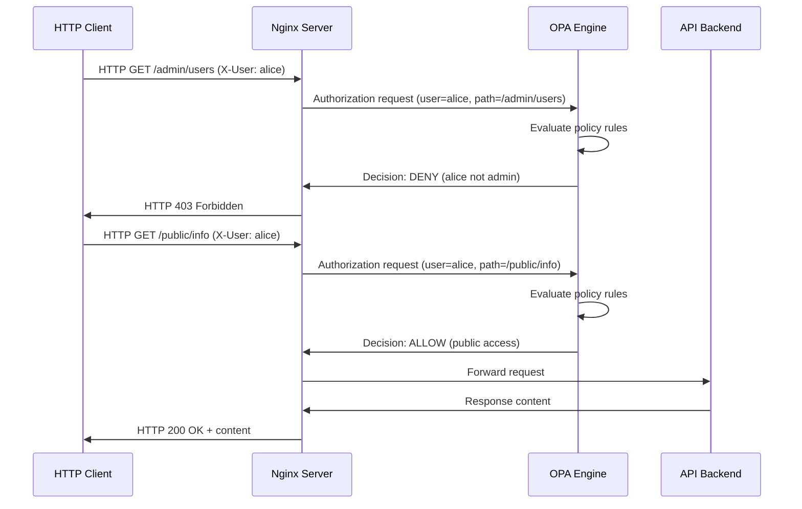

# OPA Policy NSM Example: Role-Based Access Control

Demonstrates HTTP API with sophisticated role-based access control using Open Policy Agent integrated with NSM.

## Table of Contents

- [Prerequisites](#prerequisites)
- [Quick Start](#quick-start)
- [Architecture Overview](#architecture-overview)
- [How It Works](#how-it-works)
- [YAML Files Deep Dive](#yaml-files-deep-dive)
- [Policy Configuration](#policy-configuration)
- [Access Control Rules](#access-control-rules)
- [Expected Results](#expected-results)
- [Verification](#verification-commands)
- [Troubleshooting](#troubleshooting)
- [Advanced Usage](#advanced-usage)
- [FAQ](#faq)
- [Cleanup](#cleanup)

## Prerequisites

- NSM-enabled EKS cluster (see [main README](../../README.md))
- kubectl configured for your cluster
- Completed [basic example](../basic/) and [secure-tunnel](../secure-tunnel/) examples
- Understanding of HTTP APIs, RBAC, and policy engines

## Quick Start

```bash
# Deploy and test
./deploy.sh

# Test different user access levels
kubectl exec opa-client -n ns-opa -- curl -H "X-User: alice" http://172.16.5.20/public/info
kubectl exec opa-client -n ns-opa -- curl -H "X-User: bob" http://172.16.5.20/admin/users
kubectl exec opa-client -n ns-opa -- curl -H "X-User: david" http://172.16.5.20/hr/employees
```

## What You'll Learn

- Policy-driven security with NSM network isolation
- Role-based access control (RBAC) implementation
- Open Policy Agent integration with web services
- Fine-grained API endpoint authorization

## Architecture Overview

```
┌─────────────────┐    NSM Network    ┌─────────────────┐
│     Client      │◄─────────────────►│   Web Server    │
│ Alpine + curl   │   172.16.5.0/24   │ Nginx + OPA     │
│ 172.16.5.10     │                   │ 172.16.5.20     │
└─────────────────┘                   └─────────┬───────┘
         │                                      │
         │ HTTP + X-User: alice                 │
         └──────────────────────────────────────┘
                                                │
                                         ┌──────▼──────┐
                                         │ OPA Policy  │
                                         │ Engine      │
                                         │             │
                                         │ alice: user │
                                         │ bob: mgr    │
                                         │ david: hr   │
                                         └─────────────┘
```

**Components**:
- **Client**: Alpine pod with HTTP tools (172.16.5.10)
- **Web Server**: Nginx with OPA sidecar for policy enforcement (172.16.5.20)
- **Policy Engine**: Open Policy Agent evaluating access requests
- **RBAC Rules**: Role-based permissions for different API endpoints

## How It Works



**Flow Summary**:
1. **Client request**: HTTP request with user identity header
2. **Nginx interception**: Web server forwards authorization request to OPA
3. **Policy evaluation**: OPA checks user role against requested resource
4. **Access decision**: Allow or deny based on policy rules
5. **Response**: Authorized requests proceed, unauthorized return 403

## YAML Files Deep Dive

### namespace.yaml
```yaml
apiVersion: v1
kind: Namespace
metadata:
  name: ns-opa
```
**Purpose**: Creates isolated namespace for OPA policy example.

### netsvc.yaml
```yaml
apiVersion: networkservicemesh.io/v1
kind: NetworkService
metadata:
  name: opa-service
spec:
  payload: IP
```
**Purpose**: Defines OPA network service for policy-controlled communication.

### opa-client.yaml
```yaml
apiVersion: v1
kind: Pod
metadata:
  name: opa-client
  annotations:
    networkservicemesh.io: kernel://opa-service/nsm-1?ip=172.16.5.10/24
spec:
  containers:
  - name: alpine
    image: alpine:3.15.0
    command: ["/bin/sh", "-c", "apk add --no-cache curl jq && trap : TERM INT; sleep infinity & wait"]
```

**Purpose**: HTTP client with tools for testing policy-controlled endpoints.

**Key Features**:
- **HTTP Tools**: curl for HTTP requests, jq for JSON processing
- **User Simulation**: Tests different user roles via headers
- **NSM Connection**: Connects to opa-service

### opa-server.yaml
```yaml
apiVersion: v1
kind: Pod
metadata:
  name: opa-server
  annotations:
    networkservicemesh.io: kernel://opa-service/nsm-1?ip=172.16.5.20/24
spec:
  containers:
  - name: nginx
    image: nginx:1.21-alpine
    ports:
    - containerPort: 80
    volumeMounts:
    - name: nginx-config
      mountPath: /etc/nginx/conf.d
    - name: api-content
      mountPath: /usr/share/nginx/html
  - name: opa
    image: openpolicyagent/opa:0.45.0-envoy
    ports:
    - containerPort: 8181
    args:
    - "run"
    - "--server"
    - "--config-file=/etc/opa/config.yaml"
    - "/etc/opa/policies/"
    volumeMounts:
    - name: opa-config
      mountPath: /etc/opa
    - name: opa-policies
      mountPath: /etc/opa/policies
```

**Purpose**: Multi-container pod with Nginx web server and OPA policy engine.

**Container Details**:
- **Nginx**: Web server with OPA integration for authorization
- **OPA**: Policy engine evaluating access requests
- **Sidecar Pattern**: OPA runs alongside Nginx for policy decisions

### nginx-config.yaml
```yaml
apiVersion: v1
kind: ConfigMap
metadata:
  name: nginx-config
data:
  default.conf: |
    upstream opa {
        server 127.0.0.1:8181;
    }
    
    server {
        listen 80;
        server_name _;
        
        location / {
            auth_request /auth;
            root /usr/share/nginx/html;
            try_files $uri $uri/ =404;
        }
        
        location = /auth {
            internal;
            proxy_pass http://opa/v1/data/httpapi/authz/allow;
            proxy_pass_request_body off;
            proxy_set_header Content-Length "";
            proxy_set_header X-Original-URI $request_uri;
            proxy_set_header X-Original-Method $request_method;
            proxy_set_header X-User $http_x_user;
        }
    }
```

**Purpose**: Nginx configuration integrating with OPA for authorization.

**Key Features**:
- **auth_request**: Nginx module for external authorization
- **OPA Integration**: Forwards authorization requests to OPA
- **Header Forwarding**: Passes user identity and request details

### opa-config.yaml
```yaml
apiVersion: v1
kind: ConfigMap
metadata:
  name: opa-config
data:
  config.yaml: |
    services:
      authz:
        url: http://localhost:8181
    
    bundles:
      authz:
        resource: "/v1/data"
    
    decision_logs:
      console: true
```

**Purpose**: OPA engine configuration for policy evaluation.

### opa-policies.yaml
```yaml
apiVersion: v1
kind: ConfigMap
metadata:
  name: opa-policies
data:
  policy.rego: |
    package httpapi.authz
    
    import future.keywords.if
    import future.keywords.in
    
    default allow := false
    
    # User roles mapping
    user_roles := {
        "alice": "user",
        "bob": "manager", 
        "david": "hr"
    }
    
    # Role permissions
    role_permissions := {
        "user": ["/public"],
        "manager": ["/public", "/admin"],
        "hr": ["/public", "/hr"]
    }
    
    # Allow if user has permission for the path
    allow if {
        user := input.headers["x-user"]
        role := user_roles[user]
        path := input.path
        
        some allowed_path in role_permissions[role]
        startswith(path, allowed_path)
    }
```

**Purpose**: OPA policy defining role-based access control rules.

## Policy Configuration

**User Roles**:
| User | Role | Permissions |
|------|------|-------------|
| `alice` | user | `/public/*` only |
| `bob` | manager | `/public/*`, `/admin/*` |
| `david` | hr | `/public/*`, `/hr/*` |

**Policy Logic**:
1. **User Identification**: Extract user from `X-User` header
2. **Role Lookup**: Map user to role in policy
3. **Permission Check**: Verify role has access to requested path
4. **Decision**: Allow if path matches role permissions

## Access Control Rules

**Endpoint Access Matrix**:
| Path | alice (user) | bob (manager) | david (hr) |
|------|--------------|---------------|------------|
| `/public/info` | ✅ Allow | ✅ Allow | ✅ Allow |
| `/public/status` | ✅ Allow | ✅ Allow | ✅ Allow |
| `/admin/users` | ❌ Deny | ✅ Allow | ❌ Deny |
| `/admin/config` | ❌ Deny | ✅ Allow | ❌ Deny |
| `/hr/employees` | ❌ Deny | ❌ Deny | ✅ Allow |
| `/hr/payroll` | ❌ Deny | ❌ Deny | ✅ Allow |

## Expected Results

**Successful Authorization**:
```bash
# alice accessing public endpoint
HTTP/1.1 200 OK
Content-Type: application/json

{
  "message": "Public information available to all users",
  "timestamp": "2024-01-15T10:30:00Z"
}

# bob accessing admin endpoint  
HTTP/1.1 200 OK
Content-Type: application/json

{
  "users": ["alice", "bob", "david"],
  "admin_access": true
}
```

**Access Denied**:
```bash
# alice trying to access admin endpoint
HTTP/1.1 403 Forbidden
Content-Type: text/html

<html>
<head><title>403 Forbidden</title></head>
<body>
<center><h1>403 Forbidden</h1></center>
</body>
</html>
```

## Verification Commands

```bash
# Check all pods
kubectl get pods -n ns-opa

# Test public access (should work for all users)
kubectl exec opa-client -n ns-opa -- curl -s -H "X-User: alice" http://172.16.5.20/public/info
kubectl exec opa-client -n ns-opa -- curl -s -H "X-User: bob" http://172.16.5.20/public/info
kubectl exec opa-client -n ns-opa -- curl -s -H "X-User: david" http://172.16.5.20/public/info

# Test admin access (only bob should succeed)
kubectl exec opa-client -n ns-opa -- curl -s -H "X-User: alice" http://172.16.5.20/admin/users
kubectl exec opa-client -n ns-opa -- curl -s -H "X-User: bob" http://172.16.5.20/admin/users
kubectl exec opa-client -n ns-opa -- curl -s -H "X-User: david" http://172.16.5.20/admin/users

# Test HR access (only david should succeed)
kubectl exec opa-client -n ns-opa -- curl -s -H "X-User: alice" http://172.16.5.20/hr/employees
kubectl exec opa-client -n ns-opa -- curl -s -H "X-User: bob" http://172.16.5.20/hr/employees
kubectl exec opa-client -n ns-opa -- curl -s -H "X-User: david" http://172.16.5.20/hr/employees

# Check HTTP status codes
kubectl exec opa-client -n ns-opa -- curl -s -w "%{http_code}" -H "X-User: alice" http://172.16.5.20/admin/users

# View OPA decision logs
kubectl logs opa-server -c opa -n ns-opa

# Check Nginx access logs
kubectl logs opa-server -c nginx -n ns-opa
```

## Troubleshooting

**Authorization Issues**:
```bash
# Check OPA policy evaluation
kubectl logs opa-server -c opa -n ns-opa | grep decision

# Verify Nginx configuration
kubectl exec opa-server -c nginx -n ns-opa -- nginx -t

# Test OPA directly
kubectl exec opa-server -c opa -n ns-opa -- curl -X POST localhost:8181/v1/data/httpapi/authz/allow \
  -H "Content-Type: application/json" \
  -d '{"input": {"headers": {"x-user": "alice"}, "path": "/admin/users"}}'

# Check policy syntax
kubectl exec opa-server -c opa -n ns-opa -- opa fmt /etc/opa/policies/policy.rego
```

**Common Issues**:
| Problem | Cause | Solution |
|---------|-------|----------|
| All requests denied | OPA policy error | Check policy syntax and logs |
| 502 Bad Gateway | OPA not responding | Verify OPA container status |
| Policy not loading | ConfigMap mount issue | Check volume mounts |
| Wrong user role | Policy mapping error | Verify user_roles in policy |

## Advanced Usage

<details>
<summary>Customization Options</summary>

**Dynamic Policy Updates**:
```bash
# Update policy via ConfigMap
kubectl patch configmap opa-policies -n ns-opa --patch '
data:
  policy.rego: |
    package httpapi.authz
    # Updated policy content
'

# Restart OPA to reload
kubectl delete pod opa-server -n ns-opa
```

**JWT Token Authentication**:
```rego
# Add JWT validation to policy
allow if {
    token := input.headers.authorization
    payload := io.jwt.decode_verify(token, {"secret": "your-secret"})
    user := payload[1].sub
    # Continue with role-based logic
}
```

**Time-based Access Control**:
```rego
# Add time restrictions
allow if {
    user := input.headers["x-user"]
    role := user_roles[user]
    
    # Only allow admin access during business hours
    role == "manager"
    time.now_ns() > time.parse_rfc3339_ns("2024-01-15T09:00:00Z")
    time.now_ns() < time.parse_rfc3339_ns("2024-01-15T17:00:00Z")
}
```
</details>

<details>
<summary>Monitoring & Observability</summary>

**OPA Metrics**:
```bash
# Enable OPA metrics
kubectl port-forward opa-server 8181:8181 -n ns-opa
curl localhost:8181/metrics

# Query decision logs
curl localhost:8181/v1/data/system/log
```

**Policy Testing**:
```bash
# Test policy with different inputs
kubectl exec opa-server -c opa -n ns-opa -- opa test /etc/opa/policies/
```
</details>

## Use Cases

**When to Use OPA Policy Control**:
- **API Gateway Security**: Fine-grained endpoint authorization
- **Microservice Authorization**: Service-to-service access control
- **Compliance Requirements**: Policy-driven security enforcement
- **Multi-tenant Applications**: Tenant-specific access rules

**Real-World Scenarios**:
- REST API with role-based permissions
- Administrative interfaces with restricted access
- Data access controls for sensitive information
- Regulatory compliance enforcement

## FAQ

<details>
<summary>How do I add new users and roles?</summary>

Update the `user_roles` and `role_permissions` mappings in the OPA policy ConfigMap, then restart the OPA server pod.
</details>

<details>
<summary>Can I use JWT tokens instead of headers?</summary>

Yes, modify the OPA policy to validate JWT tokens and extract user information from the token payload.
</details>

<details>
<summary>How do I implement more complex policies?</summary>

OPA supports sophisticated policy logic including time-based rules, attribute-based access control (ABAC), and external data sources.
</details>

## Next Steps

- **JWT Integration**: Implement token-based authentication
- **External Data Sources**: Connect OPA to user databases
- **Policy Testing**: Create comprehensive policy test suites
- **Monitoring Integration**: Add policy decision monitoring and alerting

## Cleanup

```bash
# Remove all resources
./cleanup.sh

# Verify cleanup
kubectl get pods -n ns-opa
kubectl get configmaps -n ns-opa
```

## Additional Resources

- [Open Policy Agent Documentation](https://www.openpolicyagent.org/docs/)
- [OPA Rego Language Guide](https://www.openpolicyagent.org/docs/latest/policy-language/)
- [Nginx auth_request Module](https://nginx.org/en/docs/http/ngx_http_auth_request_module.html)
- [RBAC Best Practices](https://kubernetes.io/docs/reference/access-authn-authz/rbac/)
