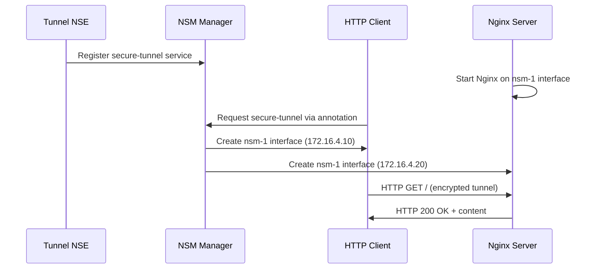

# Secure Tunnel NSM Example: Encrypted HTTP Communication

Demonstrates secure HTTP server accessible only through encrypted NSM tunnel with complete network isolation.

## Table of Contents

- [Prerequisites](#prerequisites)
- [Quick Start](#quick-start)
- [Architecture Overview](#architecture-overview)
- [How It Works](#how-it-works)
- [YAML Files Deep Dive](#yaml-files-deep-dive)
- [Security Model](#security-model)
- [Expected Results](#expected-results)
- [Verification](#verification-commands)
- [Troubleshooting](#troubleshooting)
- [Advanced Usage](#advanced-usage)
- [FAQ](#faq)
- [Cleanup](#cleanup)

## Prerequisites

- NSM-enabled EKS cluster (see [main README](../../README.md))
- kubectl configured for your cluster
- Completed [basic example](../basic/) for NSM fundamentals
- Understanding of HTTP protocols and web security

## Quick Start

```bash
# Deploy and test
./deploy.sh

# Test secure HTTP connection
kubectl exec tunnel-client -n ns-tunnel -- curl -s http://172.16.4.20
kubectl exec tunnel-client -n ns-tunnel -- wget -qO- http://172.16.4.20/status
```

## What You'll Learn

- Application-level security with NSM network isolation
- Real-world client-server communication patterns
- Zero-trust networking for web services
- Encrypted tunnel implementation for HTTP traffic

## Architecture Overview

```
┌─────────────────┐  Encrypted NSM   ┌─────────────────┐
│     Client      │◄────Tunnel──────►│   Web Server    │
│ Alpine + curl   │  172.16.4.0/24   │     Nginx       │
│ 172.16.4.10     │                  │ 172.16.4.20     │
└─────────────────┘                  └─────────────────┘
         │                                    │
         │ HTTP Request                       │ HTTP Response
         │ GET /                              │ 200 OK
         └────────────────────────────────────┘
                    Secure & Isolated
```

**Components**:
- **Client**: Alpine pod with HTTP tools (172.16.4.10)
- **Web Server**: Nginx serving HTTP content (172.16.4.20)
- **NSM Tunnel**: Encrypted connection providing network isolation
- **Security**: Server unreachable from cluster network

## How It Works



**Flow Summary**:
1. **Server initialization**: Nginx starts and binds to NSM network interface
2. **NSM tunnel setup**: Encrypted connection established between client and server
3. **HTTP communication**: Web traffic flows through secure NSM tunnel
4. **Complete isolation**: Server accessible only via NSM, not cluster network

## YAML Files Deep Dive

### namespace.yaml
```yaml
apiVersion: v1
kind: Namespace
metadata:
  name: ns-tunnel
```
**Purpose**: Creates isolated namespace for secure tunnel example.

### netsvc.yaml
```yaml
apiVersion: networkservicemesh.io/v1
kind: NetworkService
metadata:
  name: secure-tunnel
spec:
  payload: IP
```
**Purpose**: Defines secure tunnel network service for encrypted communication.

**Key Configuration**:
| Field | Value | Purpose |
|-------|-------|---------|
| `name` | `secure-tunnel` | Service identifier for tunnel |
| `payload` | `IP` | Layer 3 IP connectivity |

### tunnel-client.yaml
```yaml
apiVersion: v1
kind: Pod
metadata:
  name: tunnel-client
  annotations:
    networkservicemesh.io: kernel://secure-tunnel/nsm-1?ip=172.16.4.10/24
spec:
  containers:
  - name: alpine
    image: alpine:3.15.0
    command: ["/bin/sh", "-c", "apk add --no-cache curl wget && trap : TERM INT; sleep infinity & wait"]
```

**Purpose**: HTTP client with tools for testing web connectivity.

**Key Features**:
- **HTTP Tools**: Installs curl and wget for HTTP testing
- **Static IP**: Fixed IP address for predictable communication
- **NSM Connection**: Connects to secure-tunnel service

### tunnel-server.yaml
```yaml
apiVersion: v1
kind: Pod
metadata:
  name: tunnel-server
  annotations:
    networkservicemesh.io: kernel://secure-tunnel/nsm-1?ip=172.16.4.20/24
spec:
  containers:
  - name: nginx
    image: nginx:1.21-alpine
    ports:
    - containerPort: 80
    volumeMounts:
    - name: nginx-config
      mountPath: /etc/nginx/conf.d
    - name: html-content
      mountPath: /usr/share/nginx/html
  volumes:
  - name: nginx-config
    configMap:
      name: nginx-config
  - name: html-content
    configMap:
      name: html-content
```

**Purpose**: Nginx web server accessible only through NSM tunnel.

**Key Configuration**:
- **Nginx Image**: Lightweight Alpine-based Nginx
- **Custom Config**: Mounts ConfigMap with server configuration
- **Static Content**: Serves custom HTML content
- **Port Binding**: HTTP server on port 80

### nginx-config.yaml
```yaml
apiVersion: v1
kind: ConfigMap
metadata:
  name: nginx-config
data:
  default.conf: |
    server {
        listen 80;
        server_name _;
        
        location / {
            root /usr/share/nginx/html;
            index index.html;
        }
        
        location /status {
            access_log off;
            return 200 "NSM Secure Tunnel Active\n";
            add_header Content-Type text/plain;
        }
        
        location /health {
            access_log off;
            return 200 "OK\n";
            add_header Content-Type text/plain;
        }
    }
```

**Purpose**: Nginx configuration with custom endpoints for testing.

**Endpoints**:
| Path | Purpose | Response |
|------|---------|----------|
| `/` | Default page | Custom HTML content |
| `/status` | Tunnel status | "NSM Secure Tunnel Active" |
| `/health` | Health check | "OK" |

### html-content.yaml
```yaml
apiVersion: v1
kind: ConfigMap
metadata:
  name: html-content
data:
  index.html: |
    <!DOCTYPE html>
    <html>
    <head>
        <title>NSM Secure Tunnel</title>
    </head>
    <body>
        <h1>Welcome to NSM Secure Tunnel</h1>
        <p>This web server is accessible only through Network Service Mesh.</p>
        <p>Connection is encrypted and isolated from cluster network.</p>
        <ul>
            <li>Server IP: 172.16.4.20</li>
            <li>Client IP: 172.16.4.10</li>
            <li>Network: 172.16.4.0/24</li>
        </ul>
    </body>
    </html>
```

**Purpose**: Custom HTML content served by Nginx.

### nse.yaml
```yaml
apiVersion: apps/v1
kind: Deployment
metadata:
  name: tunnel-nse
spec:
  template:
    spec:
      containers:
      - name: nse
        image: ghcr.io/networkservicemesh/ci/cmd-nse-icmp-responder:a00fa0f
        env:
        - name: NSM_CIDR_PREFIX
          value: 172.16.4.0/24
        - name: NSM_SERVICE_NAMES
          value: "secure-tunnel"
```

**Purpose**: Network Service Endpoint enabling secure tunnel connectivity.

## Security Model

**Network Isolation**:
- **NSM-Only Access**: Web server unreachable from cluster network
- **Encrypted Transport**: All HTTP traffic encrypted via NSM tunnel
- **Identity Verification**: SPIFFE-based mutual authentication
- **Zero Trust**: No implicit network-level trust

**Security Features**:
| Feature | Implementation | Benefit |
|---------|----------------|---------|
| **Encryption** | TLS tunnel via NSM | Data protection in transit |
| **Authentication** | SPIFFE identity verification | Mutual trust establishment |
| **Isolation** | Dedicated network interfaces | Traffic segregation |
| **Access Control** | NSM annotation-based | Explicit service access |

## Expected Results

**Successful Deployment**:
```bash
# Pod status
NAME            READY   STATUS    RESTARTS   AGE
tunnel-client   1/1     Running   0          40s
tunnel-server   1/1     Running   0          45s
tunnel-nse      1/1     Running   0          50s

# HTTP response
<!DOCTYPE html>
<html>
<head>
    <title>NSM Secure Tunnel</title>
</head>
<body>
    <h1>Welcome to NSM Secure Tunnel</h1>
    <p>This web server is accessible only through Network Service Mesh.</p>
</body>
</html>

# Status endpoint
NSM Secure Tunnel Active
```

## Verification Commands

```bash
# Check all pods
kubectl get pods -n ns-tunnel

# Test HTTP endpoints
kubectl exec tunnel-client -n ns-tunnel -- curl -s http://172.16.4.20
kubectl exec tunnel-client -n ns-tunnel -- curl -s http://172.16.4.20/status
kubectl exec tunnel-client -n ns-tunnel -- curl -s http://172.16.4.20/health

# Test with wget
kubectl exec tunnel-client -n ns-tunnel -- wget -qO- http://172.16.4.20

# Check HTTP headers
kubectl exec tunnel-client -n ns-tunnel -- curl -I http://172.16.4.20

# Test connectivity
kubectl exec tunnel-client -n ns-tunnel -- ping -c 4 172.16.4.20

# Verify network isolation (should fail)
kubectl run test-pod --image=alpine:3.15.0 --rm -it -- wget -qO- http://172.16.4.20

# Check server logs
kubectl logs tunnel-server -n ns-tunnel

# Verify NSM interfaces
kubectl exec tunnel-client -n ns-tunnel -- ip addr show nsm-1
kubectl exec tunnel-server -n ns-tunnel -- ip addr show nsm-1
```

## Troubleshooting

**HTTP Connection Issues**:
```bash
# Check Nginx status
kubectl logs tunnel-server -n ns-tunnel
kubectl exec tunnel-server -n ns-tunnel -- ps aux | grep nginx

# Test basic connectivity
kubectl exec tunnel-client -n ns-tunnel -- ping -c 2 172.16.4.20
kubectl exec tunnel-client -n ns-tunnel -- telnet 172.16.4.20 80

# Verify configuration
kubectl get configmap nginx-config -n ns-tunnel -o yaml
kubectl get configmap html-content -n ns-tunnel -o yaml

# Check NSM connection
kubectl exec tunnel-client -n ns-tunnel -- ip route | grep nsm-1
kubectl exec tunnel-server -n ns-tunnel -- netstat -tlnp | grep :80
```

**Common Issues**:
| Problem | Cause | Solution |
|---------|-------|----------|
| Connection refused | Nginx not running | Check server pod logs and restart |
| HTTP timeout | Network connectivity | Verify NSM interfaces and routing |
| 404 Not Found | Missing content | Check html-content ConfigMap |
| No nsm-1 interface | NSM connection failed | Verify annotation syntax |

## Advanced Usage

<details>
<summary>Customization Options</summary>

**HTTPS Support**:
```yaml
# Add TLS configuration to nginx-config
server {
    listen 443 ssl;
    ssl_certificate /etc/ssl/certs/server.crt;
    ssl_certificate_key /etc/ssl/private/server.key;
    
    location / {
        root /usr/share/nginx/html;
        index index.html;
    }
}
```

**Custom Network Range**:
```bash
# Edit nse.yaml and client/server annotations
env:
  - name: NSM_CIDR_PREFIX
    value: "10.2.0.0/24"

# Update annotations
networkservicemesh.io: kernel://secure-tunnel/nsm-1?ip=10.2.0.10/24
```

**Load Balancing**:
```bash
# Deploy multiple server instances
kubectl scale deployment tunnel-server --replicas=3 -n ns-tunnel

# Use different IPs for each server
# 172.16.4.20, 172.16.4.21, 172.16.4.22
```
</details>

<details>
<summary>Monitoring & Observability</summary>

**Nginx Metrics**:
```yaml
# Add metrics endpoint to nginx config
location /metrics {
    stub_status on;
    access_log off;
    allow 172.16.4.0/24;
    deny all;
}
```

**Traffic Analysis**:
```bash
# Monitor HTTP access logs
kubectl logs -f tunnel-server -n ns-tunnel

# Check connection statistics
kubectl exec tunnel-server -n ns-tunnel -- netstat -an | grep :80
```
</details>

## Use Cases

**When to Use Secure Tunnel**:
- **Microservice Communication**: Secure service-to-service HTTP/API calls
- **Compliance Requirements**: Encrypted data in transit mandates
- **Zero Trust Architecture**: No implicit network trust assumptions
- **API Gateway Patterns**: Secure internal API access

**Real-World Scenarios**:
- Internal API services requiring encryption
- Database web interfaces with security requirements
- Development/staging environment isolation
- Compliance-driven secure communication

## FAQ

<details>
<summary>Can I use this with HTTPS/TLS?</summary>

Yes, configure Nginx with TLS certificates. NSM provides transport encryption, while HTTPS adds application-layer security.
</details>

<details>
<summary>How do I add authentication to the web server?</summary>

Configure Nginx with basic auth, OAuth, or integrate with external authentication providers. NSM handles network-level security.
</details>

<details>
<summary>Can multiple clients access the same server?</summary>

Yes, create additional client pods with unique IP addresses. All clients can access the same server through their NSM connections.
</details>

## Next Steps

- **Explore Advanced Examples**: Try [opa-policy](../opa-policy/) for policy-based access control
- **HTTPS Implementation**: Add TLS certificates for application-layer encryption
- **Load Balancing**: Deploy multiple server instances with load distribution
- **Monitoring Integration**: Add comprehensive HTTP and NSM monitoring

## Cleanup

```bash
# Remove all resources
./cleanup.sh

# Verify cleanup
kubectl get pods -n ns-tunnel
kubectl get configmaps -n ns-tunnel
```

## Additional Resources

- [Nginx Configuration Guide](https://nginx.org/en/docs/)
- [Zero Trust Networking Principles](https://www.nist.gov/publications/zero-trust-architecture)
- [NSM Security Architecture](https://networkservicemesh.io/)
