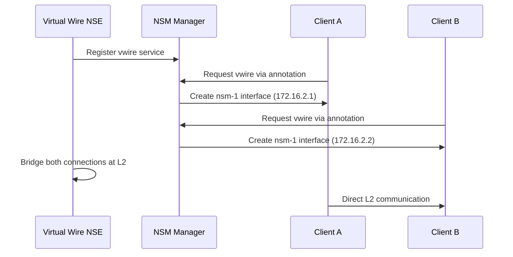

# Virtual Wire NSM Example: L2 Peer-to-Peer Connectivity

Demonstrates direct Layer 2 communication between multiple clients through NSM virtual wire service.

## Table of Contents

- [Prerequisites](#prerequisites)
- [Quick Start](#quick-start)
- [Architecture Overview](#architecture-overview)
- [How It Works](#how-it-works)
- [YAML Files Deep Dive](#yaml-files-deep-dive)
- [Expected Results](#expected-results)
- [Verification](#verification-commands)
- [Troubleshooting](#troubleshooting)
- [Advanced Usage](#advanced-usage)
- [FAQ](#faq)
- [Cleanup](#cleanup)

## Prerequisites

- NSM-enabled EKS cluster (see [main README](../../README.md))
- kubectl configured for your cluster
- Completed [basic example](../basic/) for NSM fundamentals
- Understanding of Layer 2 networking concepts

## Quick Start

```bash
# Deploy and test
./deploy.sh

# Test bidirectional connectivity
kubectl exec client-a -n ns-vwire -- ping -c 4 172.16.2.2
kubectl exec client-b -n ns-vwire -- ping -c 4 172.16.2.1
```

## What You'll Learn

- Peer-to-peer NSM connections at Layer 2
- Virtual wire service acting as ethernet bridge
- Multiple clients sharing single network service
- L2 broadcast and multicast capabilities

## Architecture Overview

```
┌─────────────────┐                   ┌─────────────────┐
│    Client A     │                   │    Client B     │
│  Alpine Pod     │                   │  Alpine Pod     │
│ 172.16.2.1      │                   │ 172.16.2.2      │
└─────────┬───────┘                   └─────────┬───────┘
          │                                     │
          │            NSM Network              │
          │         172.16.2.0/24               │
          │                                     │
          └──────────┬─────────────────┬────────┘
                     │                 │
              ┌──────▼─────────────────▼──────┐
              │      Virtual Wire NSE         │
              │    (L2 Bridge Service)        │
              └───────────────────────────────┘
```

**Components**:
- **Client A**: Alpine pod requesting vwire service (172.16.2.1)
- **Client B**: Alpine pod requesting vwire service (172.16.2.2)
- **Virtual Wire NSE**: L2 bridge connecting all clients
- **Network**: Shared /24 subnet for peer-to-peer communication

## How It Works



**Flow Summary**:
1. **NSE creates bridge**: Virtual wire service acts as ethernet switch
2. **Clients connect**: Each client gets unique IP on shared network
3. **L2 bridging**: NSE forwards ethernet frames between clients
4. **Direct communication**: Clients communicate peer-to-peer through bridge

## YAML Files Deep Dive

### namespace.yaml
```yaml
apiVersion: v1
kind: Namespace
metadata:
  name: ns-vwire
```
**Purpose**: Creates isolated namespace for virtual wire example resources.

### netsvc.yaml
```yaml
apiVersion: networkservicemesh.io/v1
kind: NetworkService
metadata:
  name: vwire
spec:
  payload: ETHERNET
```
**Purpose**: Defines the virtual wire network service for L2 connectivity.

**Key Configuration**:
| Field | Value | Purpose |
|-------|-------|---------|
| `name` | `vwire` | Service identifier for virtual wire |
| `payload` | `ETHERNET` | Layer 2 ethernet bridging |

### client-a.yaml & client-b.yaml
```yaml
apiVersion: v1
kind: Pod
metadata:
  name: client-a  # or client-b
  annotations:
    networkservicemesh.io: kernel://vwire/nsm-1?ip=172.16.2.1/24
spec:
  containers:
  - name: alpine
    image: alpine:3.15.0
    command: ["/bin/sh", "-c", "trap : TERM INT; sleep infinity & wait"]
```

**Purpose**: Network Service Clients that connect to the virtual wire service.

**Critical Annotation**:
```
networkservicemesh.io: kernel://vwire/nsm-1?ip=172.16.2.1/24
```
- **Protocol**: `kernel://` - Kernel networking for performance
- **Service**: `vwire` - Request virtual wire service
- **Interface**: `nsm-1` - Interface name in pod
- **IP Parameter**: `ip=172.16.2.1/24` - Static IP assignment with subnet

**Key Differences from Basic Example**:
- **Static IP**: Clients specify their IP addresses
- **Shared Network**: Both clients use same /24 subnet
- **Multiple Clients**: Two pods connect to same service

### nse.yaml
```yaml
apiVersion: apps/v1
kind: Deployment
metadata:
  name: vwire-nse
spec:
  template:
    spec:
      containers:
      - name: nse
        image: ghcr.io/networkservicemesh/ci/cmd-nse-vl3-vpp:a00fa0f
        env:
        - name: NSM_CIDR_PREFIX
          value: 172.16.2.0/24
        - name: NSM_SERVICE_NAMES
          value: "vwire"
```

**Purpose**: Virtual wire Network Service Endpoint providing L2 bridge functionality.

**Critical Environment Variables**:
| Variable | Value | Purpose |
|----------|-------|---------|
| `NSM_CIDR_PREFIX` | `172.16.2.0/24` | Network range for all clients |
| `NSM_SERVICE_NAMES` | `vwire` | Service this NSE provides |

**Container Image**:
- **cmd-nse-vl3-vpp**: VPP-based NSE with L2/L3 capabilities
- **Function**: Creates virtual bridge connecting multiple clients
- **Technology**: Uses Vector Packet Processing (VPP) for high performance

## Expected Results

**Successful Deployment**:
```bash
# Pod status
NAME        READY   STATUS    RESTARTS   AGE
client-a    1/1     Running   0          30s
client-b    1/1     Running   0          30s
vwire-nse   1/1     Running   0          35s

# Ping test results
PING 172.16.2.2 (172.16.2.2): 56 data bytes
64 bytes from 172.16.2.2: seq=0 ttl=64 time=0.234 ms
64 bytes from 172.16.2.2: seq=1 ttl=64 time=0.198 ms

# Interface configuration
nsm-1: <BROADCAST,MULTICAST,UP,LOWER_UP> mtu 1500 qdisc noqueue state UP
    inet 172.16.2.1/24 brd 172.16.2.255 scope global nsm-1
```

## Verification Commands

```bash
# Check all pods
kubectl get pods -n ns-vwire

# Test bidirectional connectivity
kubectl exec client-a -n ns-vwire -- ping -c 4 172.16.2.2
kubectl exec client-b -n ns-vwire -- ping -c 4 172.16.2.1

# Inspect network interfaces
kubectl exec client-a -n ns-vwire -- ip addr show nsm-1
kubectl exec client-b -n ns-vwire -- ip addr show nsm-1

# Check routing tables
kubectl exec client-a -n ns-vwire -- ip route | grep nsm-1
kubectl exec client-b -n ns-vwire -- ip route | grep nsm-1

# Test L2 features (ARP)
kubectl exec client-a -n ns-vwire -- arp -a
kubectl exec client-b -n ns-vwire -- arp -a
```

## Troubleshooting

**Connection Issues**:
```bash
# Check NSM system health
kubectl get pods -n nsm-system
kubectl logs -n nsm-system -l app=nsmgr

# Verify NSE status
kubectl logs -n ns-vwire -l app=vwire-nse

# Debug client connections
kubectl describe pod client-a -n ns-vwire
kubectl describe pod client-b -n ns-vwire
```

**Common Issues**:
| Problem | Cause | Solution |
|---------|-------|----------|
| No `nsm-1` interface | NSM client connection failed | Check NSM annotation syntax |
| Ping timeout | L2 bridge not working | Check NSE logs, verify VPP status |
| Wrong IP assignment | Static IP conflict | Verify IP parameters in annotations |
| ARP resolution fails | L2 forwarding issue | Check NSE bridge configuration |

## Advanced Usage

<details>
<summary>Customization Options</summary>

**Custom Network Range**:
```bash
# Edit nse.yaml and client annotations
env:
  - name: NSM_CIDR_PREFIX
    value: "10.1.0.0/24"

# Update client annotations
networkservicemesh.io: kernel://vwire/nsm-1?ip=10.1.0.1/24
```

**Additional Clients**:
```bash
# Create client-c.yaml with unique IP
networkservicemesh.io: kernel://vwire/nsm-1?ip=172.16.2.3/24
kubectl apply -f client-c.yaml -n ns-vwire
```

**VLAN Support**:
```bash
# Add VLAN tagging
networkservicemesh.io: kernel://vwire/nsm-1?ip=172.16.2.1/24&vlan=100
```
</details>

<details>
<summary>Monitoring & Observability</summary>

**VPP Statistics**:
```bash
# Access VPP CLI in NSE
kubectl exec -n ns-vwire deployment/vwire-nse -- vppctl show interface
kubectl exec -n ns-vwire deployment/vwire-nse -- vppctl show bridge-domain
```

**Traffic Analysis**:
```bash
# Monitor interface statistics
kubectl exec client-a -n ns-vwire -- cat /proc/net/dev | grep nsm-1
```
</details>

## Use Cases

**When to Use Virtual Wire**:
- **Legacy Applications**: Apps expecting L2 connectivity
- **Peer-to-Peer Communication**: Direct client-to-client data exchange
- **Broadcast/Multicast**: Applications requiring L2 broadcast features
- **Network Function Virtualization**: Virtual network appliances

**Real-World Scenarios**:
- Database clustering with heartbeat traffic
- Media streaming between pods
- Legacy protocol support (non-IP protocols)
- Virtual network appliance chaining

## FAQ

<details>
<summary>How many clients can connect to one virtual wire?</summary>

The VPP-based NSE can handle dozens of concurrent clients. The practical limit depends on traffic patterns and resource allocation.
</details>

<details>
<summary>Can clients use DHCP instead of static IPs?</summary>

Yes, remove the IP parameter from annotations and configure the NSE with DHCP service. However, static IPs are recommended for predictable addressing.
</details>

<details>
<summary>Does this support VLANs and other L2 features?</summary>

Yes, the VPP-based NSE supports VLAN tagging, QoS marking, and other advanced L2 features through additional annotation parameters.
</details>

## Next Steps

- **Explore Advanced Examples**: Try [dns](../dns/) or [secure-tunnel](../secure-tunnel/)
- **Multi-Node Setup**: Test virtual wire across different nodes
- **Custom NSE**: Build NSE with custom L2 forwarding logic
- **Performance Testing**: Benchmark throughput and latency

## Cleanup

```bash
# Remove all resources
./cleanup.sh

# Verify cleanup
kubectl get pods -n ns-vwire
```

## Additional Resources

- [NSM Virtual Wire Documentation](https://networkservicemesh.io/)
- [VPP Documentation](https://fd.io/docs/vpp/)
- [Layer 2 Networking Concepts](https://en.wikipedia.org/wiki/Data_link_layer)
